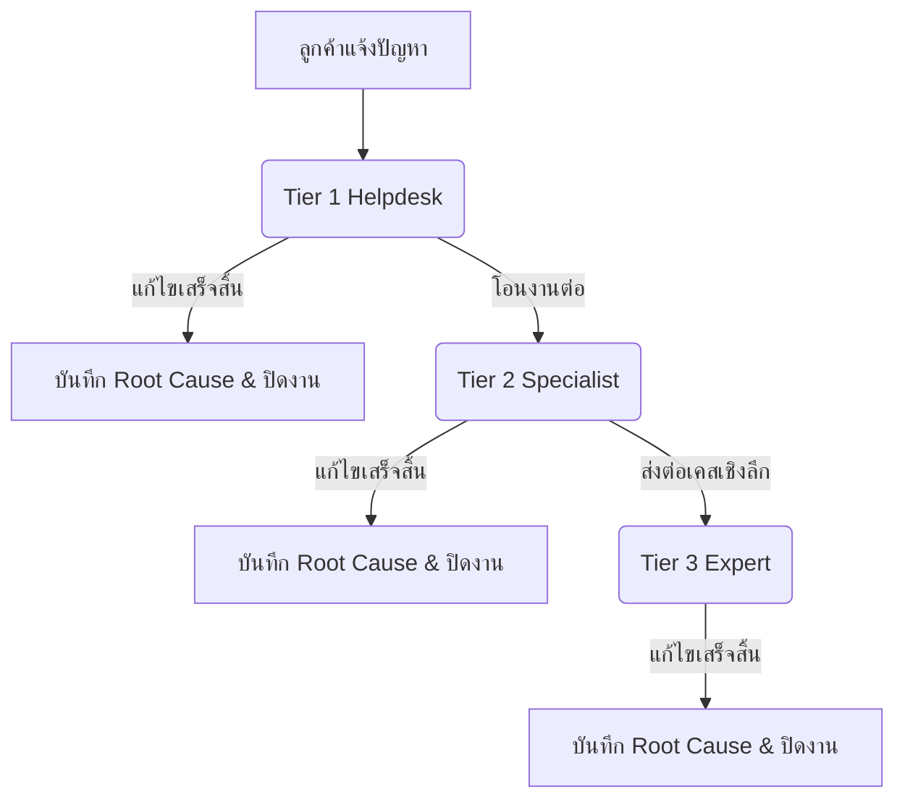

# 📘 คู่มือการใช้งานระบบ IT Helpdesk Support (ฉบับอัปเกรด)

คู่มือนี้จัดทำขึ้นเพื่อแนะนำวิธีการใช้งานฟีเจอร์ต่าง ๆ ในระบบ **IT Helpdesk** สำหรับพนักงานทั่วไป เจ้าหน้าที่ไอที Tier 1/2/3 และผู้ดูแลระบบ

---

## 🔐 1. การเข้าสู่ระบบ (Login) และความปลอดภัย

ระบบได้เพิ่มความเสถียรในการเชื่อมต่อ และเพิ่มฟังก์ชันความปลอดภัยในหน้าเข้าสู่ระบบ

* **ข้อมูลการล็อกอิน (Login Credentials)**:
  * **ผู้ดูแลระบบ (Admin)**: รหัสผ่านคือ `password123` เสมอ
  * **พนักงานทั่วไปและเจ้าหน้าที่ทั่วไป (Non-Admin)**: รหัสผ่านได้รับการเปลี่ยนเป็น `test123`
* **การแสดงผลรหัสผ่าน (Show Password Toggle)**:
  * ในหน้าจอล็อกอิน สามารถคลิกปุ่ม **ไอคอนดวงตา** เพื่อเปิดดูรหัสผ่านที่ป้อนได้
  * รหัสผ่านจะแสดงผลค้างไว้เป็นเวลา **20 วินาที** จากนั้นระบบจะสลับกลับไปเป็นสัญลักษณ์จุดซ่อนรหัสผ่านโดยอัตโนมัติ เพื่อป้องกันการมองแอบดูหน้าจอ
* **เซสชันการเชื่อมต่อ (HTTP Session Stability)**:
  * ระบบได้รับการปิดการบังคับคุ๊กกี้แบบ `secure: true` ชั่วคราว เพื่อรองรับให้คุณใช้งานเซสชันผ่านลิงก์เว็บหลักที่เป็นโปรโตคอล HTTP (`http://vibehelpdesk.online`) ได้อย่างราบรื่นโดยไม่โดนเด้งออกจากระบบสุ่มสี่สุ่มห้า

#### 📸 ภาพประกอบการเข้าสู่ระบบและความปลอดภัย

*ภาพที่ 1: หน้าล็อกอินหลักแสดงข้อมูลบัญชีสำหรับทดสอบระบบ (Demo Credentials) ไว้ด้านล่าง*

*ภาพที่ 2: ระบบแจ้งเตือน "อีเมลหรือรหัสผ่านไม่ถูกต้อง" เพื่อป้องกันความปลอดภัยเมื่อผู้ใช้ระบุรหัสผ่านไม่ตรง*

*ภาพที่ 3: ผู้ใช้งานสามารถกดไอคอนดวงตาเพื่อตรวจสอบความถูกต้องของรหัสผ่านที่กรอก (ระบบจะซ่อนกลับอัตโนมัติใน 20 วินาที)*

*ภาพที่ 4: การเปิดเผยรหัสผ่านด้วยฟังก์ชันสลับการแสดงผลรหัสผ่านในหน้ารายละเอียดผู้ใช้งาน*

---

## 💬 2. ระบบแชทพูดคุยและการแจ้งเตือน (Chat & LINE Integration)

ช่วยให้การประสานงานตอบโต้ปัญหาทำได้รวดเร็วขึ้น

### การเปิดห้องแชทของลูกค้า (ผู้แจ้งปัญหา)
1. สังเกตปุ่ม **ไอคอนแชทลอยตัวสีน้ำเงิน** บริเวณมุมขวาล่างของหน้าจอ
2. คลิกปุ่มแชทลอยตัว จากนั้นป้อน **หมายเลข Ticket (Job No.)** (เช่น `CRD2206202600001`) แล้วกดตกลง
3. ระบบจะทำการตรวจสอบหมายเลขและพาเข้าสู่ห้องแชทโดยอัตโนมัติ คุณสามารถพิมพ์ข้อความฝากถึงช่างเทคนิคได้จากจุดนี้

### การตอบแชทของเจ้าหน้าที่ไอที
* เจ้าหน้าที่ฝ่ายไอทีสามารถตรวจสอบและตอบแชทกับลูกค้าได้ผ่านหน้ารายละเอียดตั๋ว (Ticket Detail) ที่หัวข้อ **Chat / Discussion**
* กล่องข้อความฝั่งที่ผู้ใช้พิมพ์ตอบจะแสดงชิดขวาเป็นสีน้ำเงินในหน้าต่างของคนพิมพ์ และชิดซ้ายสีขาวในหน้าต่างของอีกฝ่าย
* **LINE OA Notification**: หากลูกค้ารายดังกล่าวแจ้งเรื่องผ่าน LINE Bot ระบบจะทำการส่งข้อความแจ้งเตือนความคืบหน้าตรงเข้าหา LINE ส่วนตัวของลูกค้าคนนั้น ๆ ทุกครั้งเมื่อเจ้าหน้าที่ไอทีตอบกลับผ่านหน้าเว็บ

#### 📸 ภาพประกอบระบบแชทและการแจ้งเตือน

*ภาพที่ 5: หน้าล็อกอินแสดง LINE Official QR Code ให้พนักงานทั่วไปสแกนเพื่อเริ่มแชทแจ้งเรื่องปัญหากับบอทผ่านทาง LINE OA*

*ภาพที่ 6: ปุ่มไอคอนแชทลอยตัวสีน้ำเงินมุมขวาล่าง of หน้าล็อกอินเพื่อเข้าสู่ฟังก์ชันการติดตามสถานะ/แชท*

*ภาพที่ 7: หน้าต่างแชทลูกค้า (Customer Widget) ป้อนหมายเลข Ticket ID เพื่อเชื่อมต่อเข้าคุยกับช่างไอที*

*ภาพที่ 8: ส่วนแสดงกล่องแชท (Chat / Discussion) ในหน้ารายละเอียดตั๋วของช่าง ข้อความจัดชิดขวาเป็นสีน้ำเงินตามสิทธิ์ผู้ส่งจริง*

---

## 🛠️ 3. ขั้นตอนการประเมินและการส่งต่อเคส (Support Tiers Flow)

ระบบการประสานงานแก้ไขปัญหาถูกแบ่งออกเป็น 3 ระดับปฏิบัติการ (Tier 1-3) ดังนี้

### 🧑‍💻 3.1 สิทธิ์และขั้นตอนของ Tier 1 (Helpdesk)
ทำหน้าที่คัดกรอง รับเรื่อง และแก้ไขปัญหาระดับเบื้องต้น
1. เปิดเข้าไปที่แดชบอร์ด **"รับเรื่อง / ประเมิน"** จากแถบเมนูด้านข้าง
2. เลือกเปิดดูเคสที่เข้ามาใหม่ กดปุ่ม **"รับเรื่อง (Accept)"**
3. เมื่อตรวจสอบปัญหาแล้ว สามารถบันทึกผลการประเมินเบื้องต้น (`Initial Assessment`), สันนิษฐานสาเหตุ (`Preliminary Cause`) และบันทึกผลดำเนินการ (`Action Taken`)
4. **กรณีต้องการโอนต่อ (Escalate to Tier 2)**:
   * ในการ์ด **"ส่งต่อให้ Tier 2"** ให้เลือกรายชื่อเจ้าหน้าที่ Tier 2 จาก **Dropdown** (ระบบบังคับเลือก ห้ามปล่อยว่าง)
   * กรอกเหตุผลในการโอนงาน และกดปุ่ม **"โอนงานให้ Tier 2"**
5. **กรณีแก้ไขได้เสร็จสิ้นโดย Tier 1**:
   * กรอกสาเหตุที่แท้จริง (`Root Cause`) และวิธีการแก้ไข (`Resolution`)
   * กดปุ่ม **"แก้ไขเสร็จสิ้นและปิดงาน (Resolve)"**

#### 📸 ภาพประกอบขั้นตอนของ Tier 1

*ภาพที่ 9: หน้าแบบฟอร์มประเมินเบื้องต้นของ Tier 1 (Initial Assessment) และส่วนปุ่มกดสำหรับบันทึกหรือส่งต่อให้ Tier 2*

---

### 🔧 3.2 สิทธิ์และขั้นตอนของ Tier 2 (Specialist Support)
ทำหน้าที่แก้ไขปัญหาที่ส่งต่อมาจาก Tier 1 ในเชิงลึก หรือเกี่ยวข้องกับระบบซอฟต์แวร์/ฮาร์ดแวร์เฉพาะทาง
1. เปิดเมนู **"แก้ไขปัญหา"** จากแถบเมนูด้านข้างเพื่อดูงานที่ได้รับมอบหมาย
2. **กรณีแก้ไขได้เสร็จสิ้นโดย Tier 2**:
   * ให้กรอกข้อมูลสาเหตุที่แท้จริง (`Root Cause`) หมวดหมู่ปัญหา และรายละเอียดการแก้ไขลงในฟอร์ม **Resolve Directly** จากนั้นกดส่งเพื่อยืนยันการปิดงาน
3. **กรณีต้องการโอนต่อผู้เชี่ยวชาญเชิงลึก (Escalate to Tier 3)**:
   * คลิกปุ่ม **"Escalate to Tier 3"**
   * เลือกรายชื่อผู้เชี่ยวชาญ Tier 3 หรือผู้ดูแลระบบที่ต้องการมอบหมายผ่าน Dropdown
   * กำหนดวันและเวลาประมาณการที่จะแก้ไขเสร็จสิ้น (`Estimated Resolve Time`)
   * กรอกข้อสมมติฐานทางเทคนิคเบื้องต้น (`Assumption`)
   * กดส่งข้อมูลเพื่อโอนงาน

---

### ⚙️ 3.3 สิทธิ์และขั้นตอนของ Tier 3 (Deep Resolution Support)
ทำหน้าที่แก้ไขปัญหาเชิงลึกระดับเซิร์ฟเวอร์ โครงสร้างพื้นฐาน หรือปัญหาระดับวิกฤต
1. เปิดแดชบอร์ด **"แก้ไขเคสเชิงลึก (Tier 3)"** จากแถบเมนูด้านข้าง
2. เลือกงานที่ต้องการจัดการแล้วกดปุ่ม **"รับเรื่องปฏิบัติงาน (Accept)"**
3. เจ้าหน้าที่สามารถคลิก **"ปรับปรุงเวลาแก้ไข (Update Estimation)"** เพื่ออัปเดตเวลานัดหมายหรือระบุข้อสมมติฐานเพิ่มเติมได้ตลอดเวลา
4. เมื่อซ่อมแซมเสร็จสิ้น ให้กรอกข้อมูลสาเหตุ (`Root Cause`) และรายละเอียดวิธีแก้ไขปัญหาในฟอร์มปิดงาน จากนั้นกดยืนยันเพื่อบันทึก

#### 📸 ภาพประกอบขั้นตอนของ Tier 3

*ภาพที่ 10: หน้าแดชบอร์ดงาน Tier 3 แสดงตารางรายการตั๋วปัญหาที่มีสถานะเป็น "ESCALATED TO TIER 3" เพื่อให้เข้ามากดรับงานและจัดการปัญหา*

---

## 📊 4. รายงานงานค้างสะสม (Aging Report)

รายงานที่ใช้ในการประเมินความเร็วในการแก้ไขและป้องกันปัญหางานค้างเกินระยะ SLA

1. ไปที่หน้า **Dashboardหลัก** ของระบบ
2. เลื่อนลงมาที่หัวข้อ **"Aging Report (รายงานสรุปงานค้างแยกตาม Tier)"**
3. **ตารางสรุป (Summary Tab)**:
   * จะแสดงจำนวนเคสที่ยังค้างคาอยู่ของแต่ละ Tier แบ่งเป็นกลุ่มระยะเวลา: น้อยกว่า 24 ชั่วโมง, 1-3 วัน, 3-7 วัน, และมากกว่า 7 วัน
   * ตัวเลขจะแสดงสีแตกต่างกันตามระดับความเร่งด่วนของงาน
4. **แท็บรายงานแยกตาม Tier**:
   * คลิกเลือกแท็บ เช่น **"งานค้าง Tier 2"** เพื่อเปิดดูข้อมูลเคสจริงที่ค้างอยู่ ณ ระดับปฏิบัติการนั้น ๆ
   * แถบรายงานจะแจกแจง Job No, หัวข้อปัญหา, ระบบ, ชื่อช่างเทคนิคที่รับผิดชอบ และ **ระยะเวลานับจริง (เช่น ค้างสะสม 4.5 วัน)** พร้อมมีจุดสีนำสายตาเตือนระดับความล่าช้า
   * สามารถกดปุ่ม **"View"** ด้านหลังเพื่อเปิดเข้าไปช่วยเหลือ หรือเร่งเคสได้โดยตรง

#### 📸 ภาพประกอบตารางสถิติและตารางข้อมูลสะสมหลัก

*ภาพที่ 11: แดชบอร์ดแนวโน้มสถิติตั๋วปัญหาหลัก (ส่วน Aging Report จะแสดงเพิ่มเติมด้านล่างของแดชบอร์ดนี้แยกตารางตาม SLA)*
